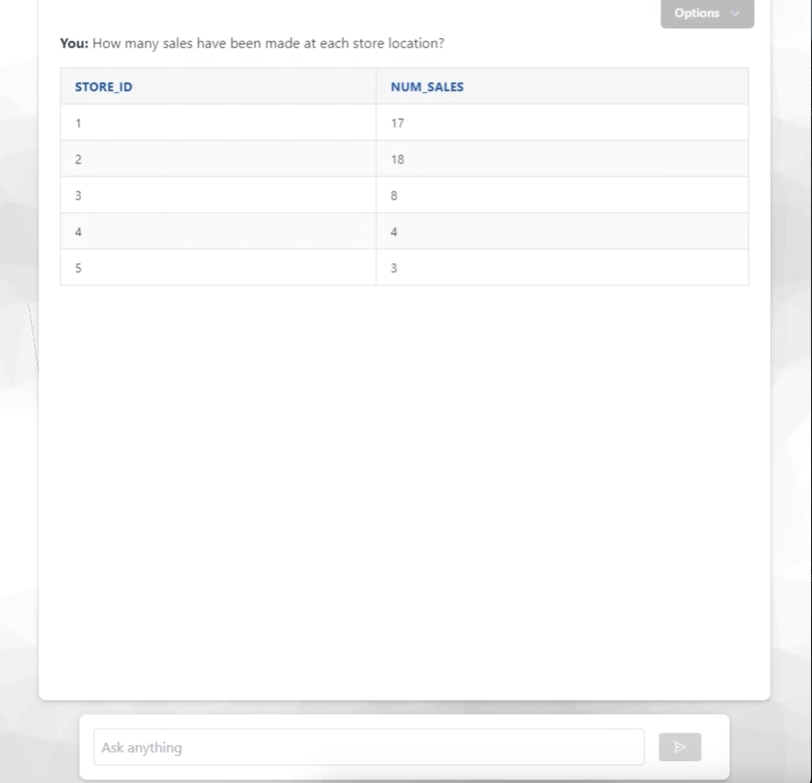

<!-- Improved compatibility of back to top link: See: https://github.com/othneildrew/Best-README-Template/pull/73 -->
<a name="readme-top"></a>
<!--
*** Thanks for checking out the Best-README-Template. If you have a suggestion
*** that would make this better, please fork the repo and create a pull request
*** or simply open an issue with the tag "enhancement".
*** Don't forget to give the project a star!
*** Thanks again! Now go create something AMAZING! :D
-->

<!-- PROJECT LOGO -->
<br />
<div align="center">
  <a href="https://github.com/othneildrew/Best-README-Template">
    
  </a>

  <h3 align="center">SQL Speaker</h3>

  <p align="center">
    A Text-to-SQL application to query Snowflake database using natural language
    <br />
    <br />
  </p>
</div>

<!-- TABLE OF CONTENTS -->
<details>
  <summary>Table of Contents</summary>
  <ol>
    <li>
      <a href="#about-the-project">About The Project</a>
    </li>
    <li>
      <a href="#getting-started">Getting Started</a>
      <ul>
        <li><a href="#prerequisites">Prerequisites</a></li>
        <li><a href="#installation">Installation</a></li>
      </ul>
    </li>
    <li><a href="#usage">Usage</a></li>
    <li><a href="#license">License</a></li>
    <li><a href="#contact">Contact</a></li>
  </ol>
</details>


<!-- ABOUT THE PROJECT -->
## About The Project



### Presentation
SQL Speaker is an API that converts natural language text into SQL statements for querying a Snowflake database. The API is designed to simplify database interactions, making it accessible to users without extensive SQL knowledge (Business stakeholders, Managers). This enables quick and easy data retrieval from a database by simply describing the data request in plain English.

### Architecture

add schema
1.

<p align="right">(<a href="#readme-top">back to top</a>)</p>


<!-- GETTING STARTED -->
## Getting Started

This app can be installed running Docker (recommended) or locally.

### Prerequisites

* Create a Snowflake account : [https://www.snowflake.com](https://www.snowflake.com)
* Get an OpenAI API key, see : [https://platform.openai.com/docs/quickstart?context=python](https://platform.openai.com/docs/quickstart?context=python)
* Install Python : [https://www.python.org/downloads](https://www.python.org/downloads)
* Install Docker Desktop : [https://www.docker.com/products/docker-desktop](https://www.docker.com/products/docker-desktop)

### Installation

1. On your Snowflake account, if you have not any database created yet, create a database and schema, and copy/paste both the `create.sql` then `insert.sql` scripts in order to have data to query. 
2. Rename the `.env.example` file to `.env` and fill the variables with your values.
3. Run Docker on your laptop
4. Run `docker build -t sql-speaker .`. It will build the API's Docker image.
5. Run `start.sh` file. It will run a container using the previous built image.

<p align="right">(<a href="#readme-top">back to top</a>)</p>


<!-- USAGE EXAMPLES -->
## Usage

The API is available on port 5000 with endpoint `/ask`. A typical request should be as the following :

```
{
  "query": "What is the total sales revenue for each product category ?",
  "sql_in_answer": false,
  "sql_mode": false
}
```
* Set `sql_in_answer` to `true` to include the query generated by OpenAI API in the response.
* Set `sql_mode` to `true` to make a plain SQL query. OpenAI API will not be called and the query will be directly addressed to Snowflake.

<p align="right">(<a href="#readme-top">back to top</a>)</p>

<!-- LICENSE -->
## License

Distributed under the MIT License. See `LICENSE.txt` for more information.

<p align="right">(<a href="#readme-top">back to top</a>)</p>


<!-- CONTACT -->
## Contact

Wadieh Karbal - [https://www.linkedin.com/in/wadieh-k-865b40181/](https://www.linkedin.com/in/wadieh-k-865b40181/)

<p align="right">(<a href="#readme-top">back to top</a>)</p>
